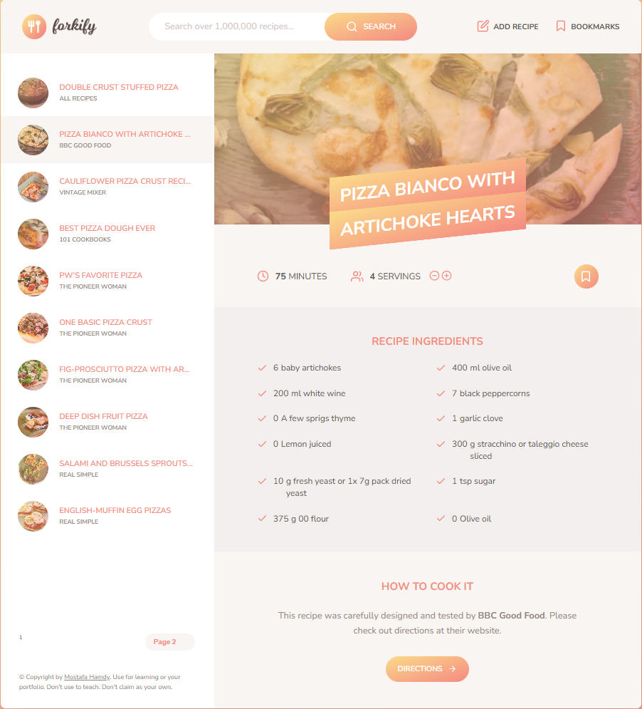

# Forkify Recipe Application 🍳



A modern web application for discovering and saving recipes from around the world. Search through millions of recipes, save your favorites, and even upload your own creations!

## Table of Contents
- [Features](#features-)
- [Demo](#demo-)
- [Installation](#installation-)
- [Technologies](#technologies-)

## Features ✨

- **Recipe Search**: Find recipes by name, ingredients, or keywords
- **Detailed View**: Complete recipe details with cooking time, servings, and ingredients
- **Bookmarking**: Save your favorite recipes for quick access
- **Custom Recipes**: Add your own personal recipes to the collection
- **Responsive Design**: Works perfectly on all device sizes
- **Pagination**: Browse through search results efficiently

## Demo 🌐

Check out the live version: [Forkify Live Demo](https://forkify-mostafa.netlify.app/)

## Installation 💻

1. Clone the repository:
```bash
git clone https://github.com/yourusername/forkify-app.git
cd forkify-app
npm install
npm start
```

## Technologies 🛠️

### Core Technologies
- **Frontend**: 
  - HTML5 (Semantic markup)
  - CSS3 (SASS for styling)
  - JavaScript (ES6+ modern syntax)
  
### APIs & Services
- **Forkify API** (Recipe data)
- **Netlify** (Hosting & deployment)
